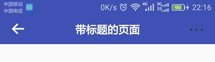

# Use

```
    implementation 'com.mirkowu:BaseToolbar:0.0.4'
```

### First Way :in XML
```xml
   <LinearLayout
         android:layout_width="match_parent"
         android:layout_height="match_parent"
         android:orientation="vertical">
         
         <com.mirkowu.basetoolbar.BaseToolbar
             android:id="@+id/mToolbar"
             android:layout_width="match_parent"
             android:layout_height="wrap_content" />
             
            // ...这里写布局
             
    </LinearLayout>
```

```java
    //代码设置
    mToolbar.setTitle("我是标题BaseToolbar");//设置标题
    mToolbar.setBackButton(R.mipmap.back);//这里简化设置返回键，点击调用onBackPress() 
    mToolbar.hideBackButton();//需要的时候还可以隐藏 
    mToolbar.setBottomDivider(Color.GRAY, 1);//设置底部分割线，此处高度单位为px
    mToolbar.hideBottomDivider();//需要的时候还可以隐藏 
    mToolbar.setStatusBarColor(Color.TRANSPARENT);//需要的话可以设置状态栏颜色，原理为增加一个状态栏高度的View
    mToolbar.hideStatusBar();//需要的时候还可以隐藏 
    mToolbar.setTitleTextColor(Color.BLACK);//设置标题颜色
    mToolbar.setSubTextColor(Color.GRAY);//设置菜单文本颜色
    //添加常用的菜单
    mToolbar.addRightText("右菜单", OnClickListener);
    mToolbar.addRightText("右菜单", Color.BLACK, OnClickListener);//设置颜色,优先级 比setSubTextColor()高
    mToolbar.addLeftText("左菜单", OnClickListener);
    mToolbar.addLeftText("左菜单", Color.BLACK, OnClickListener);
    mToolbar.addRightImage(R.drawable.menu, OnClickListener);
    mToolbar.addLeftImage(R.drawable.menu, OnClickListener);
    //工具本身也提供了一些创建菜单的方法，
    mToolbar.addRightView(BaseToolbar.createTextMenu(context,text,textColor,textSize,onClickListener));
    mToolbar.addLeftView(BaseToolbar.createImageMenu(context,imageResId,onClickListener));
    //如果这些基础的不能满足 可以添加自定义View
    mToolbar.addRightView(view);
    mToolbar.addLeftView(view);
    mToolbar.addCenterView(view);
   
```
### Second Way : Code create

```java
    //可以代码创建,建议使用Builder创建
    BaseToolbar toolbar=  new BaseToolbar.Builder()
      .setTitle("我是标题BaseToolbar")
      .setBackButton(R.mipmap.back)
      .setBottomDivider(Color.GRAY, 1)
      .setStatusBarColor(Color.TRANSPARENT)
      .setTitleTextColor(Color.BLACK)
      //......优雅的链式调用，快捷高效
      .bulid();
      
    //还可搭配BaseActivity使用，更方便，详情见demo
```
需要注意的是
```java

    //将toolbar设置为actionbar 
    activity.setSupportActionBar(mBaseToolbar);
    //要执行这步需保证项目使用的主题Theme为 NoActionBar系列，或者设置
    <item name="windowActionBar">false</item>
    <item name="windowNoTitle">true</item>
```

### 截图
     
                 

# proguard-rules
```java
    -keep class com.mirkowu.basetoolbar.** {*;}
```